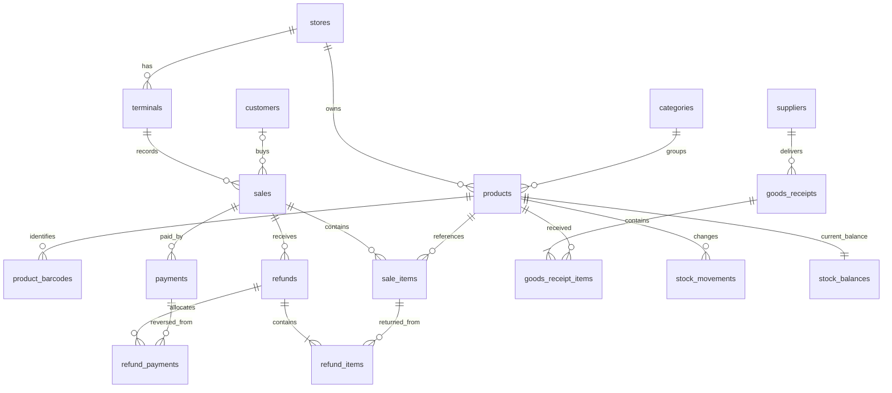

# PostgreSQL / Supabase design for Mizan

Status: target architecture, based on src/model.ts, src/App.tsx and src/printing.ts. A tested local database foundation is now implemented; see ../supabase/README.md (from repository root: supabase/README.md) for exact coverage and connection gates. The app remains in local-storage demo mode.

## Recommended scope

Start with one store, but make stock, terminals, memberships and transactions store-scoped. Do not build a multi-company SaaS layer, purchasing/accounting suite, or offline synchronization engine yet. A product belongs to one store in this first version. Add shared cross-store catalogs only when needed.

Use relational rows for business records. Use JSONB only for audit metadata, versioned receipt presentation settings, and legacy import archives. Reports are queries/views over posted records, not separately editable totals.

## Tables and links

Every entity uses a UUID primary key unless a composite key is specified. All operational timestamps are timestamptz. FK means foreign key.

| Table | Main columns and relationships |
|---|---|
| stores | id, name, currency_code, currency_scale, timezone, receipt_settings JSONB |
| store_memberships | PK(store_id, user_id); store_id FK stores, user_id FK auth.users, role (cashier/manager/admin), active |
| terminals | id, store_id FK, name, printer_settings JSONB, active; hardware status must not imply verified connection |
| categories | id, store_id FK, name, color_hex, sort_order, active, legacy_id; Favorites is a filter, not a category |
| products | id, store_id FK, category_id FK, name, unit, selling_price_minor, tax_rate, discountable, low_stock_threshold, active, legacy_id |
| product_barcodes | id, store_id FK, product_id FK, barcode TEXT, kind (manufacturer/internal), is_primary; unique(store_id, barcode) |
| scale_items | product_id FK/unique, store_id FK, scale_code TEXT; unique(store_id, scale_code); five digits; configured local prefix/layout lives in store settings |
| product_favorites | PK(user_id, product_id), store_id; optional user-specific favorites, no fake category row |
| suppliers | id, store_id FK, name, optional contact fields, active |
| product_suppliers | PK(product_id, supplier_id), store_id, supplier_product_code, preferred; optional until multiple suppliers are used |
| stock_balances | PK(store_id, product_id); quantity numeric(18,6), last_purchase_cost_minor numeric(20,6), version; transactionally maintained projection of stock movements |
| customers | id, store_id FK, name, normalized_phone, loyalty_card, tier, active; unique non-null phone/card per store |
| sales | id, store_id FK, terminal_id FK, cashier_id FK auth.users, customer_id nullable FK, status (draft/held/partially_paid/completed/voided/cancelled), sale_mode (retail/wholesale), receipt_number, created_at, completed_at, voided_at, subtotal/discount/tax/total_minor, pricing_version, note, version |
| sale_items | id, store_id, sale_id FK, product_id FK, quantity numeric(18,6), stock_quantity numeric(18,6), name/barcode/unit snapshots, unit_price_minor, unit_cost_minor nullable, tax_rate snapshot, discount/tax/total_minor, scale_weight and scanned_barcode optional |
| payments | id, store_id, sale_id FK, method, status, amount_minor, tendered_minor, change_minor, is_simulated, provider_reference nullable, created_at; multiple payments per sale |
| refunds | id, store_id, sale_id FK, cashier_id, approval_id FK, reason, total_minor, posted_at, status |
| refund_items | id, store_id, refund_id FK, sale_item_id FK, quantity, stock_quantity_returned, amount_minor, tax_minor, cost_minor nullable; unique(refund_id, sale_item_id) |
| refund_payments | id, store_id, refund_id FK, payment_id FK, amount_minor, status; ties each refund allocation to its original payment |
| goods_receipts | id, store_id, supplier_id FK, delivery_reference, status (draft/posted/reversed), created_by, approval_id FK, posted_at |
| goods_receipt_items | id, store_id, goods_receipt_id FK, product_id FK, quantity, unit_cost_minor, expiry_date nullable, batch_code nullable |
| stock_movements | id, store_id, product_id FK, signed quantity_delta, balance_after, kind, occurred_at, actor_id, approval_id optional; nullable sale_item_id/refund_item_id/goods_receipt_item_id FKs and reversal_of FK to this table |
| approvals | id, store_id, requested_by, approved_by FK auth.users, action, payload_hash, reason, status, expires_at, consumed_at; issued by trusted backend after manager authentication |
| audit_events | id, store_id, actor_id, approval_id optional FK, action, entity_type, entity_id, reason, metadata JSONB, occurred_at; append-only |
| loyalty_entries | id, store_id, customer_id FK, sale_id/refund_id optional FK, points_delta integer, approval_id optional FK, reason, occurred_at; balance derived from ledger |
| coupons | id, store_id, code unique per store, rule_type, value, valid_from/until, usage_limit, active |
| coupon_redemptions | id, store_id, coupon_id FK, sale_id FK, discount_minor; unique(coupon_id, sale_id); usage checked under lock |
| operation_requests | id, store_id, request_key, operation, payload_hash, result_id, completed_at; unique(store_id, request_key) for safe retries |

Do not implement every optional table before connecting. Core path: identities/catalog, sales/items/payments, receiving/items, refunds/items/allocations, balances/movements, approvals/audit/idempotency. Loyalty and coupons follow before migrating those existing features.

## Relationship overview

## Integrity rules

- Use composite references `(store_id, referenced_id)` backed by corresponding unique keys. A valid UUID alone must not permit a sale to reference another store's customer, product, terminal, or approval.
- Refund items must reference an item on the refund's sale, and refund payments a payment on that sale. Enforce through composite foreign keys and posting procedures, not only UI validation.
- Index FK columns and common access paths: sales(store_id, completed_at), refunds(store_id, posted_at), movements(store_id, product_id, occurred_at), receipts(store_id, posted_at), and memberships(user_id, store_id). Start with ordinary indexes; add trigram indexes for name search only if needed.
- Keep barcodes as text to preserve leading zeros. Enforce barcode format, unique primary barcode per product, and unique scale codes. An embedded price barcode resolves through scale_items; do not save every variable-weight scan as a permanent product barcode.
- Monetary totals: bigint in configured currency minor units; never floating point. IQD formally has three minor digits, while this app displays whole dinars. Choose currency_scale=3 and convert existing integer-dinar amounts by 1,000 at import; preserve whole-dinar rounding policy for the current UI. Unit prices/costs may use exact numeric(20,6) minor units for fractional quantity calculations. Round transaction totals once according to an explicit pricing policy. Return bigint/numeric as decimal strings across JavaScript boundaries, or validate safe-integer bounds.
- Positive item quantities and nonnegative prices/costs; nullable historical cost means unknown, never zero. Tax rate numeric with range 0..100. Piece quantities must be integral. Weight/volume use a canonical product unit; stock_quantity is separate from a scanned item's basket count.
- Archive products/categories/suppliers instead of deleting referenced records. Restrict deletion of posted financial records. Completed sale item snapshots are immutable even if product names, prices, categories or taxes later change.
- Preserve allocated line discounts/tax/coupon/reward amounts on completion. Partial refunds use original allocated amounts, with the final refund receiving any rounding remainder, never today's prices.
- Inventory source links use real FKs, with checks matching kind to its required source. Opening stock and manual adjustments require a reason and manager authorization. Each posting/source has a unique movement key; reversals reference originals and cannot restore stock twice.
- Expiry belongs to a delivery/batch, not one global product field. Phase one records expiry on receipt lines but does not claim batch-level remaining-stock tracking. If expiry stock tracking is needed, add inventory_lots and sale-to-lot allocations before making those claims.

## Atomic operations

Expose database RPC functions, each running in one database transaction. The browser submits intent; the server validates membership, approvals, amounts, and status.

1. register_product: validate duplicates, consume bound manager approval, insert product/barcode/balance, add opening-stock movement and audit entry atomically.
2. record_payment: lock sale; reject mutation of closed sales; validate payment amount and retry key. Preserve partial payments across reconnects. Do not let clients invent a successful provider payment.
3. complete_sale: lock sale and relevant stock balances in stable product order; check current prices/version, outstanding payments and sufficient stock; freeze pricing/cost snapshots; deduct stock, insert movements, finalize sale and loyalty/coupon changes atomically. No negative stock by default.
4. post_receipt: lock receipt and balances; validate supplier/reference/positive quantity and cost; consume manager approval; add stock and movements, set latest delivery cost, finalize and audit in the same transaction. Multiple products can belong to one delivery without repeating supplier/reference.
5. refund_sale: lock original sale/items/payments; validate cumulative returns and allocations; consume approval; insert refund and refund allocations; restore eligible stock and reverse relevant loyalty entries atomically. Concurrent refunds must not exceed original quantities or amounts.
6. void_sale: lock sale; refuse already-voided or refunded sales under current app rules; reverse stock and payments once, preserve originals and audit. Do not delete the sale.

Every mutation takes a client-generated request UUID plus payload hash. Reusing a key with the same payload returns the original outcome; a different payload is rejected. A failed operation rolls back all changes. On an uncertain network result, retry the same key. Guard draft edits with a version comparison so two terminals cannot overwrite each other silently.

Real payment providers cannot participate in a Postgres transaction. Later use a provider adapter and webhook/reconciliation state machine with provider idempotency. Until then all payment/refund/drawer events remain explicitly simulated.

Latest posted receipt cost feeds subsequent sale snapshots, matching the app's current costing method. This is not FIFO or weighted average.

## Supabase connection and permissions

React -> supabase-js (publishable key + authenticated session) -> read APIs / narrowly scoped RPC -> PostgreSQL.

- No direct browser Postgres connection string, service-role key, or manager password in app code.
- Staff use Supabase Auth; store_memberships controls roles. Do not reuse the prototype's demo manager approval as production authentication.
- Enable RLS on exposed tables, revoke unnecessary grants, allow reads only for active store members. Limit customer data and cost/profit views to appropriate roles.
- Clients cannot directly insert/update/delete posted payments, stock balances, movements, approvals or audit events. RPCs enforce permissions and invariants. Sensitive tables may live in a non-exposed schema.
- Prefer SECURITY INVOKER functions when possible. Any necessary SECURITY DEFINER function needs an empty/fixed safe search_path, qualified names, explicit auth checks and narrowly granted EXECUTE (revoke PUBLIC/anon). It must never trust submitted actor_id or role.
- Manager approval is bound to action, payload, store and expiry, consumed once. A client-supplied approved=true or arbitrary manager UUID is never authorization.
- Report views must obey RLS (security_invoker where supported) or run through role-checked reporting functions. Realtime may refresh stock displays but does not replace locks or transaction checks.
- Keep print preferences per terminal; receipt/store details per store. Local printer driver selection and verified hardware status stay device-specific.

## Reports

Create query views/functions for sales, refunds, product profitability, receiving and movements. Return CSV from the same filtered dataset. Use store timezone when converting a date range to an inclusive start/exclusive end UTC range.

Exclude voided sales from sales totals; subtract refunds by their own posted timestamp for period cash activity. Also offer a clearly named original-sale cohort view if desired. Do not silently mix those two interpretations. Historical voids need voided_at/payment reversal timestamps for period reconciliation. Exclude unknown cost from estimated profit and report its excluded revenue/count. Profit is before operating expenses. Avoid joining raw payments and raw sale_items together before aggregation, which multiplies totals.

## Migration from the current browser demo

1. Export and preserve mizan-pos-v1, mizan-products-v1, mizan-inventory-v1 and mizan-printer-v1 before importing. Import each terminal's export with an import batch ID/hash; retrying cannot duplicate it.
2. Create one store/terminal and authenticated memberships. Keep a legacy_id mapping for p1/custom IDs and saved category IDs. Use Arabic category names and current category colors. Translate takeaway -> retail and dinein -> wholesale at the boundary.
3. Import catalog, customers and transaction snapshots. Import historical missing timestamps/costs as unknown with provenance; do not guess them from current products. Preserve original source JSON in a private import archive for reconciliation.
4. Reconcile inventory carefully: do not import current stock as opening stock AND replay its whole movement history on top. Use a cutover balance and archived history, or reconstruct a verified opening balance and replay once.
5. Add a repository adapter around the current local-storage operations. Migrate reads first, then drafts, then atomic sales/receipts/refunds. Keep the saved demo as a separate mode/data source rather than mixing it with live records.
6. Initially require connection for posting sales, receiving and refunds. Offline drafts are possible, but a dependable offline checkout needs a separate sync/conflict design.

## Local test plan

Use Supabase CLI's local Docker stack, versioned SQL migrations and synthetic seeds. The existing app Docker Compose is not a Supabase database stack. The CLI discovered a Docker daemon and the local stack now runs on ports 55321–55324. Migrations, PostgreSQL concurrency tests, and Supabase Auth/REST tests passed.

Acceptance tests before integration:

- Clean migrations/seed apply successfully; all FK/check/unique constraints reject invalid data.
- Anonymous, cashier, manager, disabled membership and other-store access tests for reads and writes.
- Simultaneous checkout of last stock unit: exactly one succeeds.
- Concurrent partial refunds cannot exceed original quantities/payment allocations.
- Same request twice creates one sale/receipt/refund; altered payload with same key is rejected.
- Injected failure between payment/stock/finalization causes full rollback.
- Expired/replayed/wrong-action approvals fail; client cannot forge roles/amounts/audit entries.
- Receiving updates latest cost; past sales retain old cost; unknown historical cost stays unknown.
- Split payment survives reload; void cannot restore stock twice; refund/void reporting balances.
- Decimal weight, leading-zero barcode, tax/discount rounding, timezone boundaries and import replay tests.
- Then run existing unit and isolated browser regression suites against the adapter.

## Official references

- [Supabase local development](https://supabase.com/docs/guides/local-development/cli-workflows): CLI plus Docker-compatible runtime, migrations and seed workflow.
- [Supabase RLS](https://supabase.com/docs/guides/database/postgres/row-level-security): grants and policies, exposed tables, service-role isolation and view access.
- [Supabase database functions](https://supabase.com/docs/guides/database/functions): RPC functions and execution permissions.

These references inform the Supabase integration. The table layout and business rules above are recommendations tailored to this prototype.
